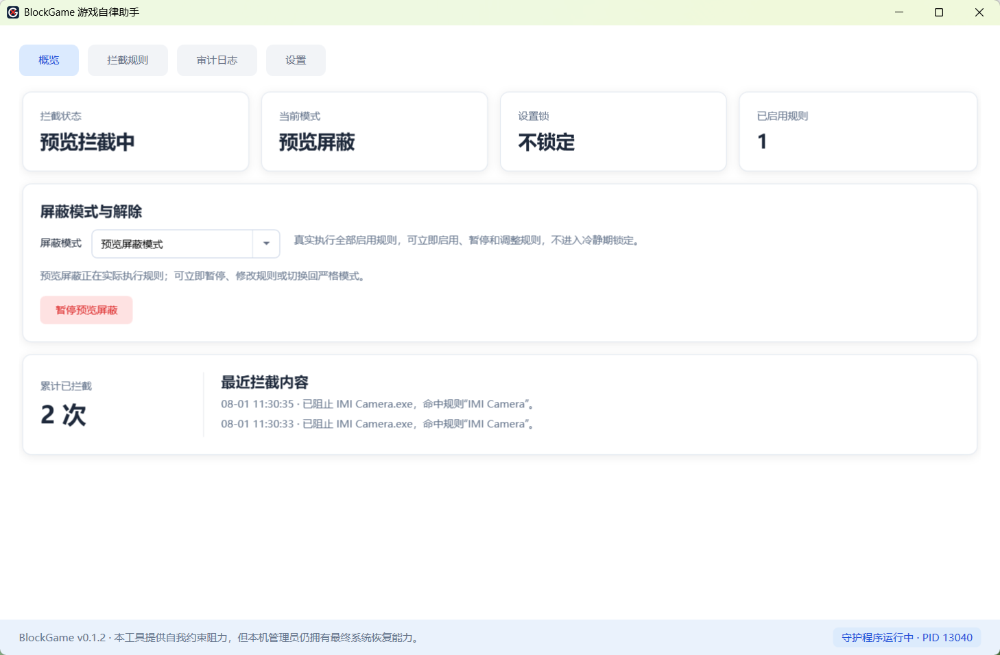
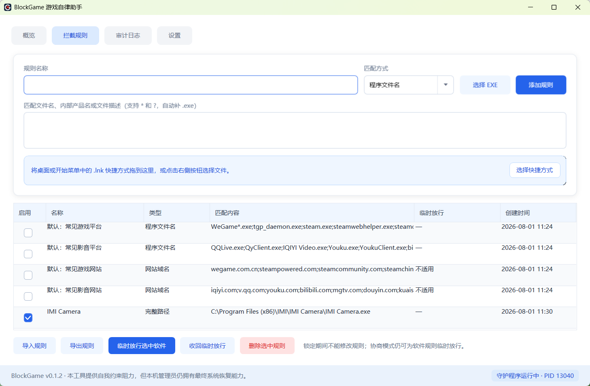
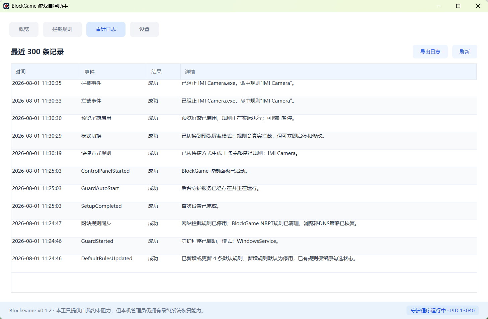
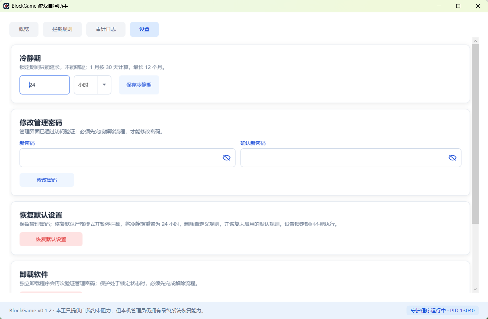
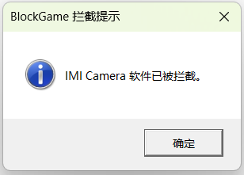

# BlockGame v0.1.2

BlockGame 是一个面向 Windows 11 的自我约束工具。它通过后台守护程序监控进程启动，匹配规则后立即终止程序，并用管理密码、解除冷静期和一次性卸载令牌增加绕过阻力。

## 界面预览

主界面实时显示拦截状态、当前模式、设置锁和累计拦截情况：



| 拦截规则 | 审计日志 |
| :---: | :---: |
|  |  |

| 设置 | 拦截提示 |
| :---: | :---: |
|  |  |

## 当前版本包含

- 文件名规则：例如 `steam.exe`、`game*.exe`
- 文件名规则同时匹配 EXE 内部产品名和文件描述；仅修改外部文件名后仍可命中对应规则
- 完整路径规则：支持 `*` 和 `?`
- 网站域名规则：`poki.com` 会同时屏蔽其子域名，可一行一个或使用分号分隔
- 网站屏蔽通过 Windows NRPT 只接管命中域名，不修改网卡全局 DNS，也不修改 `hosts`
- 网站规则启用时关闭并锁定 Chrome、Edge、Firefox 的加密 DNS，停用或恢复默认设置后恢复原值
- 规则添加、启用、停用和删除
- 规则可导出为独立 JSON 文件，也可从 JSON 导入；导入会校验安全性并跳过重复规则
- “拦截规则”页支持拖入或选择一个或多个 Windows `.lnk` 快捷方式，读取真实目标 EXE，经确认后自动生成启用的完整路径规则；带启动参数的快捷方式会提示规则将作用于整个 EXE
- 文件名可直接填写 `qq` 或 `qq*`，程序会自动补全为 `qq.exe` / `qq*.exe`
- 单条文件名规则也可填写 `qq;wechat;steam*`，每一项分别匹配
- 首次运行会添加“常见游戏平台”和“常见影音平台”两条内置预设，默认停用，可勾选启用、右键修改或删除
- 默认使用严格模式：启用后立即锁定；暂停拦截、削弱规则或切换到预览屏蔽模式，必须申请解除并等待冷静期结束
- 协商模式同样会锁定规则和模式，但管理员可对选中的软件规则再次验证密码，按 1 分钟～24 小时临时放行；到期后自动恢复拦截
- 预览屏蔽模式会真实执行规则，便于确认规则是否命中；可立即启用、暂停、修改规则或切换回严格模式，不需要等待
- “恢复默认设置”保留管理密码，切回严格模式、暂停拦截并恢复 24 小时冷静期和未启用的默认规则；锁定期间不可执行，操作前会确认并再次验证密码
- Windows 系统托盘常驻图标；登录后静默启动，只显示托盘图标，不弹密码框或主界面；关闭主窗口后可从托盘重新打开或退出控制面板
- 守护服务异常退出或被任务管理器结束后，按 0.5 秒、1 秒、3 秒三档快速恢复；服务管理器中的普通“停止”也会视为非授权终止并自动拉起，连续稳定运行 24 小时后重置失败计数
- 手动启动或从托盘重新打开管理界面时验证一次管理密码；恢复默认设置等高影响操作会再次确认和验证
- 规则首列提供启用复选框，可连续点击多条规则快速启用或停用
- 成功拦截会实时写入“拦截事件”日志；审计页可导出包含原始日志、守护心跳和诊断摘要的 ZIP；守护服务会直接向当前 Windows 登录桌面发送“XX 软件已被拦截”提示，托盘控制面板作为失败兜底
- LocalSystem Windows 服务，可自动重启
- PBKDF2-SHA256 管理密码哈希和输错限速
- 解除保护确认文本和冷静期（1 分钟～12 个月，可按小时、天或月设置；1 月按 30 天计算）
- 一次性、十分钟有效的卸载授权令牌
- 本地 JSON 配置、JSONL 审计日志和守护心跳
- Windows 关键进程安全名单，避免规则误伤系统

## 构建

本机已经验证 .NET 9 SDK。默认构建为 framework-dependent 发布：目标电脑需要安装 .NET 9 Desktop Runtime。

```powershell
powershell -ExecutionPolicy Bypass -File .\scripts\build.ps1
```

如果希望发布包自带运行时（体积更大）：

```powershell
powershell -ExecutionPolicy Bypass -File .\scripts\build.ps1 -SelfContained
```

## 安装

必须在“管理员 PowerShell”中执行：

```powershell
powershell -ExecutionPolicy Bypass -File .\scripts\install.ps1
```

## 构建 Setup.exe

正式发布包默认包含 Windows x64 自带运行时版本，目标电脑无需另装 .NET：

```powershell
powershell -ExecutionPolicy Bypass -File .\scripts\build-installer.ps1 -Version 0.1.2
```

构建完成后发布以下两个文件：

- `artifacts\release\BlockGame-Setup.exe`
- `artifacts\release\BlockGame-Setup.exe.sha256`

`BlockGame-Setup.exe` 会请求管理员权限，安装管理界面、后台守护服务、开机自启服务、桌面与开始菜单快捷方式，以及安全卸载入口。

安装后打开“BlockGame 游戏自律助手”：

1. 设置管理密码和解除冷静期。
2. 添加要禁止的 `.exe` 文件名、完整路径或网站域名；也可把桌面或开始菜单中的 `.lnk` 快捷方式拖到规则页自动生成规则。
3. 可先切换到“预览屏蔽模式”并启用，实际测试规则是否成功拦截；预览模式可立即暂停。
4. 确认规则有效后，可选择“严格模式”或“协商模式”并启用锁定；协商模式允许管理员在规则页为选中的软件设置一次临时运行时长。
5. 后台服务会持续监控进程；锁定后，切换模式或永久削弱保护仍必须完成冷静期解除。

如果直接运行 `artifacts\publish\app\BlockGame.App.exe`，程序在首次进入主界面前也会自动查找并安装 `BlockGameGuard` 服务；它会从同级的 `..\guard` 目录复制守护程序到 `C:\Program Files\BlockGame`，然后启动服务。若只复制了 App 文件而没有携带 guard 发布目录，自动安装会失败并给出提示。

## 正常卸载

可以从以下任一入口运行独立卸载程序：

- BlockGame“设置”页中的“卸载 BlockGame”
- Windows“已安装的应用”
- 开始菜单中的“卸载 BlockGame”
- 安装目录中的 `BlockGame.Uninstall.exe`

完成首次设置后，卸载程序必须验证 BlockGame 管理密码。若保护处于锁定状态，必须先提交解除申请并等待冷静期结束；尚未完成首次设置、还没有管理密码的安装可直接确认移除。卸载会删除本机规则、配置和审计日志。

软件更新、重新安装和授权卸载会写入一个最多有效 30 秒的一次性维护标记，因此这些操作可以正常停止守护服务，不会触发自动拉起。

## 开发测试

```powershell
dotnet run --project .\tests\BlockGame.SelfTest\BlockGame.SelfTest.csproj
```

也可以使用 `scripts\run-guard-console.ps1` 在控制台运行守护程序。开发模式的数据目录为项目下的 `.dev-data`。

## 重要限制

v0.1.2 使用高频进程监控，因此被拦截程序可能短暂出现；AppLocker / WDAC 的创建和签名策略将在后续版本加入。网站规则按域名生效，无法只屏蔽 URL 中的某个路径；企业域策略、VPN 或自带代理/解析器的软件可能优先使用自己的策略。拥有本机管理员权限的人仍可以进入安全模式、离线修改文件或重装系统。本项目不使用隐藏持久化、内核驱动或破坏系统的方式。
